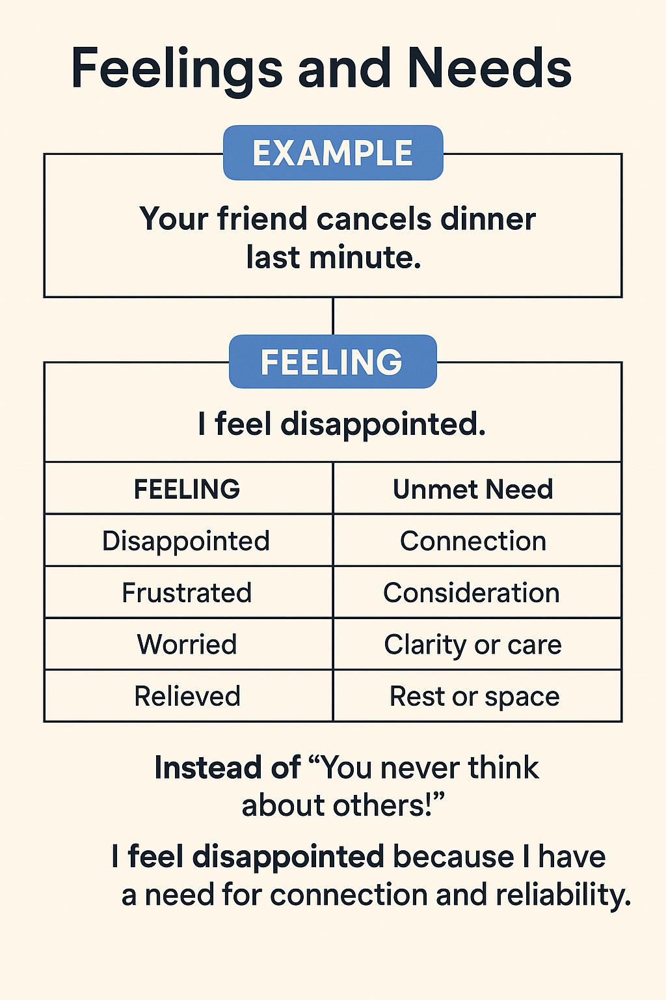

+++
title = "NVC"
date = "2025-05-13"
description = "Nonviolent Communication by Marshall Rosenberg"
tags = [
    "book",
    "communication",
]
+++

### Feelings vs Needs

**Feeling**  
Our emotional response to a situation, based on whether a need is met or unmet. Feelings are internal and personal.

**Need**  
A universal human requirement such as connection, safety, rest, or understanding. Feelings arise from how well these needs are fulfilled.

---

### Example

**Trigger:** A friend cancels dinner last minute.

**Feeling:** Disappointed  
**Need:** Connection, reliability

Depending on the individual, this event may evoke different feelings based on different needs:
- "I feel disappointed because I needed connection."
- "I feel relieved because I needed rest."
- "I feel hurt because I needed to feel considered."

The event (cancellation) is neutral; our reaction is shaped by our inner needs.

---

### What We Usually Say
"You ruined my evening!"

### What We Can Say Instead (NVC Style)
"I feel disappointed because I was really looking forward to spending time with you and needed connection. Can we find another time to meet?"

By identifying the feeling and underlying need, we express ourselves without blame, creating space for empathy and understanding.

I learnt this from the book *Nonviolent Communication* by Marshall Rosenberg. This simple shift helps transform how we experience and express emotions.

[Here is a link to list of feelings and needs. ](https://nvcacademy.com/media/NVCA/learning-tools/NVCA-feelings-needs.pdf)

