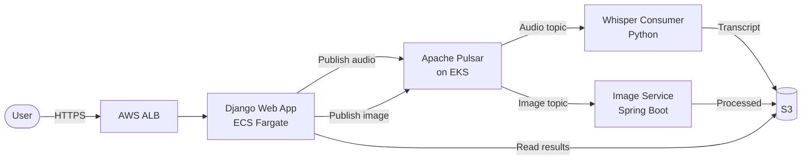

+++
date = '2026-04-09'
draft = false
title = "Over-engineering an async AI voice chat app, on purpose"
description = "Seven repos, four languages, Apache Pulsar on Kubernetes — and the honest reason the architecture looks like this."
+++

This is an async AI voice chat app. You record a voice message, send it to a friend, they listen and reply when they're ready. In the background, OpenAI Whisper transcribes the audio and a separate service handles image processing. Conceptually, it's a ten-line Django view with a file upload and a row in a `message` table.

That's not what I built.

What I built is seven repos, four languages, Apache Pulsar running on Amazon EKS with end-to-end TLS, a Spring Boot image service, a Python Whisper transcription consumer, a Django web app deployed to ECS Fargate behind an AWS CDK CodePipeline, and a cert-manager setup issuing certificates from AWS Private CA to every pod in the cluster.

None of this is necessary. All of it is on purpose.

This post is the honest explanation for why a side project about voice messages looks like a distributed systems exam — and a tour of the architecture for anyone who wants to know what each piece does.

## The honest reason: it's a learning vehicle

The thing I never see on side-project blog posts is the admission that the project is actually a pretext. This app isn't going to have users. It's not a startup. It's not a product. It's a shape I chose so I had a concrete reason to learn:

- **Apache Pulsar**, because I wanted to understand a distributed messaging system that isn't Kafka
- **Kubernetes on EKS**, because the managed services I work around professionally are where "I know how to run a stateful workload on EKS" becomes a useful sentence
- **TLS and PKI**, because cert-manager looks easy until you actually try to use AWS Private CA and discover why trust chains matter
- **Polyglot microservices**, because every service doing the same thing in Python wouldn't teach me how services actually talk to each other
- **AWS CDK**, because infrastructure-as-code is the only honest way to own a cloud deployment

A simpler architecture would have taught me less. The over-engineering *is* the feature.

Once you accept that, the decisions stop looking strange.

## What the app actually is

The flow is:

1. A user records an audio message and hits send in the Django UI
2. Django uploads the audio to S3 and publishes a message to a Pulsar topic
3. The Python Whisper consumer picks up the message, transcribes the audio, writes the transcript back
4. If there's an image attached, the Spring Boot service handles it in parallel via a separate topic
5. The Django app reads back the results and displays them in the chat thread

Everything except the Django request handler is asynchronous. Everything except S3 runs in a container I own.

## Why Pulsar (and not Kafka or RabbitMQ)

This is the single decision I'm asked about most. Honestly, any of the three would have worked for a chat app. Here's why I picked Pulsar:

- **Separation of compute and storage.** Pulsar brokers are stateless. The actual data lives in BookKeeper bookies. That's a cleaner architectural model than Kafka's "broker is also the storage engine," and it maps better to how I think about services. It also means I can scale throughput and storage independently
- **Multi-tenancy is first-class.** Pulsar has a tenant / namespace / topic hierarchy out of the box. I didn't need it for a chat app, but it meant future-me could add a "topics per user" abstraction without rebuilding the cluster
- **Tiered storage.** Pulsar can offload old messages to S3 automatically. I didn't enable this, but it's the kind of feature that matters in a real production system
- **It's less popular than Kafka.** This sounds backwards, but it's true: the Kafka-on-K8s operational story is well-trodden. Everyone has seen it. Pulsar-on-K8s is less documented, which meant I'd have to *actually learn* the system instead of copy-pasting a tutorial

For a chat app with no users, none of this matters. For a learning vehicle, all of it matters.

## The component tour

### Django web app (Python)

The front door. Handles auth, the chat UI, and routing messages into Pulsar. Deployed on **ECS Fargate** (not EKS) because I wanted to keep the stateless web tier isolated from the stateful messaging infrastructure. The split was deliberate: Fargate is great for "ship a container, forget about it," and EKS is where I put the stuff that actually benefits from Kubernetes primitives.

Deployed via an **AWS CDK CodePipeline** — Django code lands in GitHub, a pipeline builds a Docker image, pushes it to ECR, and deploys it to a Fargate service. The pipeline itself is [babblebox-cdk-pipeline](https://github.com/shivaam/babblebox-cdk-pipeline).

### Apache Pulsar cluster (EKS)

The backbone. Runs on Amazon EKS via the official Helm chart, with everything TLS-encrypted end-to-end. The interesting bits:

- **BookKeeper for durable storage.** Pulsar doesn't store messages in the broker — it stores them in BookKeeper ledgers, striped across an ensemble of bookies. Entries are the smallest unit; ledgers are append-only write-ahead logs; bookies store ledger fragments (not whole ledgers) for performance. I have [a separate post](https://medium.com/@shivaam/set-up-apache-pulsar-on-aws-eks-in-60-minutes-a3b98ef2fb71) on setting this up end-to-end
- **cert-manager for TLS.** Every pod that needs a certificate gets one auto-issued from AWS Private CA via the [aws-privateca-issuer](https://github.com/cert-manager/aws-privateca-issuer) plugin. I have [another post](https://medium.com/@shivaam/setting-up-tls-on-a-kubernetes-loadbalancer-with-aws-eks-f31c6e9b1f18) on the TLS setup
- **nginx-ingress behind an ALB.** The ingress controller sits behind an AWS Application Load Balancer doing Layer 7 routing based on URL paths. Direct pod-level services use NLBs at Layer 4 instead. The AWS Cloud Provider auto-creates the ELBs for `Service: LoadBalancer` resources on Kubernetes ≥ 1.24, so I don't run the AWS Load Balancer Controller
- **Pulsar Manager disabled**, because I never needed it. One fewer moving part

I spent more time on the TLS setup than on the messaging code. That was the point.

### Whisper transcription consumer (Python)

Subscribes to the audio topic, downloads the message, runs it through OpenAI's Whisper model, and writes the transcript back. Packaged as a Docker container and deployed via [whisper-pulsar-consumer-cdk](https://github.com/shivaam/whisper-pulsar-consumer-cdk).

The interesting part here isn't the Whisper model — it's learning how Pulsar subscription semantics work. Exclusive vs. shared vs. key-shared subscriptions. Acknowledgement modes. What happens when a consumer dies mid-processing. The chat app is incidental; the consumer lifecycle is the lesson.

### Spring Boot image service (Java)

The reason this is Java at all is that I wanted one service in a language I don't use day-to-day. The Pulsar Java client is the most mature of the three clients, Spring Boot is the default "production Java" framework, and the combination meant I'd learn something instead of cruising.

It consumes from an image topic, handles processing, and writes results back to S3. Less interesting than Whisper because the actual image work is boring — but the Java / Spring Boot / Pulsar integration was the point.

## Infrastructure, in one sentence per component

- **EKS cluster**, provisioned manually for now (CDK version is a TODO)
- **Pulsar Helm chart**, with Pulsar Manager disabled
- **cert-manager + aws-privateca-issuer**, issuing TLS certs to ingress and pods
- **nginx-ingress controller**, fronted by an AWS ALB at Layer 7
- **ECS Fargate cluster**, for the Django web tier
- **ECR**, for the Docker image registry
- **S3**, for audio and image blob storage
- **CDK CodePipeline**, for the Django CI/CD flow

Each one is a rabbit hole. Each rabbit hole is the point.

## What I'd do differently

This is the section most side-project posts fake. I'm going to be direct:

- **I'd put the Django app on EKS too.** Splitting compute between ECS Fargate and EKS doubled my operational surface. The original reason (separating stateful from stateless) made sense on paper, but in practice the cognitive cost of running two orchestrators for a side project is too high
- **I'd use Let's Encrypt instead of AWS Private CA.** Private CA was a fascinating learning exercise. It's also genuinely over-engineered for a public web app. Let's Encrypt + cert-manager is what every real side project should do
- **I'd write the architecture post first.** This one. The one you're reading. What I actually want people to find is the explanation, not the individual how-to posts. I started with the how-tos because they were easier to write; I should have started with the map
- **I'd finish fewer things.** This project has a long tail of unchecked TODOs across five repos. Most of them will stay unchecked, and that's fine — the goal of a learning project isn't to ship, it's to learn. But I'd be more honest about that upfront, to myself and to anyone reading along

## The related posts

This is the hub post. The individual deep dives live here:

- **[Set up Apache Pulsar on AWS EKS in 60 Minutes](https://medium.com/@shivaam/set-up-apache-pulsar-on-aws-eks-in-60-minutes-a3b98ef2fb71)** — the Helm chart walkthrough
- **[Setting up TLS on a Kubernetes LoadBalancer with AWS EKS](https://medium.com/@shivaam/setting-up-tls-on-a-kubernetes-loadbalancer-with-aws-eks-f31c6e9b1f18)** — the ACM + LoadBalancer version
- **[Accessing Grafana for Apache Pulsar via Ingress Controller](https://medium.com/@shivaam/accessing-grafana-for-apache-pulsar-via-ingress-controller-d2e5f8a1c0b3)** — the observability side

And the repos:

- [babblebox](https://github.com/shivaam/babblebox) — Django web app
- [babblebox-image-service](https://github.com/shivaam/babblebox-image-service) — Spring Boot image service
- [whisper-pulsar-consumer](https://github.com/shivaam/whisper-pulsar-consumer) — Python transcription consumer
- [babblebox-cdk-pipeline](https://github.com/shivaam/babblebox-cdk-pipeline) — Django CI/CD
- [whisper-pulsar-consumer-cdk](https://github.com/shivaam/whisper-pulsar-consumer-cdk) — Whisper consumer infra

